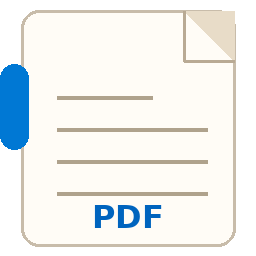
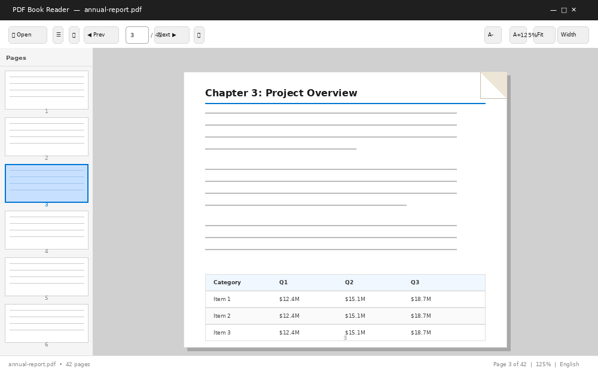
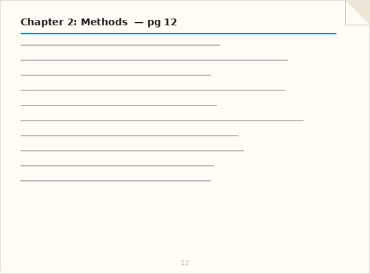

<div align="center">



# Roon

**A fast, elegant PDF reader with book-style page flip animation**

[](https://github.com/YOUR_USERNAME/roon/releases/latest)
[](https://github.com/YOUR_USERNAME/roon/actions)
[](https://github.com/YOUR_USERNAME/roon/actions)
[](LICENSE)
[](https://python.org)

*Read more. Scroll less. Roon turns every PDF into a book.*

[⬇️ Windows Download](#-download) · [🍎 Mac Download](#-download) · [📖 Run from Source](#-run-from-source) · [🌍 Languages](#-languages)

---

### App Preview



### Page Flip Animation



</div>

---

## ✨ Features

- **📖 Book-style page flip** — smooth, realistic page turning animation
- **🌍 11 languages** — English, हिंदी, اردو, العربية, Français, Español, 中文, Deutsch, Português, Italiano, 日本語
- **⚡ Fast rendering** — smart LRU page cache with background pre-rendering
- **🖼️ Thumbnail sidebar** — click any page thumbnail to jump to it
- **🔍 Zoom controls** — fit page, fit width, or custom zoom (10%–500%)
- **⌨️ Full keyboard navigation** — arrows, Page Up/Down, Home, End
- **💾 Saves preferences** — language choice remembered between sessions
- **🪟 Windows 11 style UI** — clean, modern, distraction-free
- **🚫 No ads, no telemetry** — fully offline, fully open source

---

## ⬇️ Download

> **Windows: No installation required.** Download and double-click to run.

| Platform | Download | Notes |
|----------|----------|-------|
| 🪟 **Windows** | [**Roon.exe**](https://github.com/YOUR_USERNAME/roon/releases/latest/download/Roon.exe) | Portable — just double-click |
| 🍎 **macOS** | [**Roon-macOS.dmg**](https://github.com/YOUR_USERNAME/roon/releases/latest/download/Roon-macOS.dmg) | Drag to Applications |
| 🐧 **Linux** | [Run from source](#-run-from-source) | Python + venv |

### Windows Security Warning

When you see *"Windows protected your PC"*:
→ Click **More info** → **Run anyway**

This appears because Roon is not signed with a paid certificate. The full source code is available here on GitHub for review.

---

## 📖 Run from Source

### Requirements
- Python 3.10 or newer → [python.org/downloads](https://python.org/downloads)
- Windows: check **"Add Python to PATH"** during install

### Windows

```bash
git clone https://github.com/YOUR_USERNAME/roon.git
cd roon
setup_and_run.bat
```

After first setup, just run `run.bat` next time.

### macOS / Linux

```bash
git clone https://github.com/YOUR_USERNAME/roon.git
cd roon
chmod +x run.sh && ./run.sh
```

### Manual Setup

```bash
python3 -m venv venv
source venv/bin/activate      # Mac/Linux
# venv\Scripts\activate.bat   # Windows

pip install -r requirements.txt
python generate_icon.py
python pdf_reader.py
```

---

## 🌍 Languages

Switch from the **Language** menu anytime — your choice is saved automatically.

| | Language | | Language |
|-|----------|-|----------|
| 🇬🇧 | English | 🇩🇪 | Deutsch |
| 🇮🇳 | हिंदी | 🇧🇷 | Português |
| 🇵🇰 | اردو | 🇮🇹 | Italiano |
| 🇸🇦 | العربية | 🇯🇵 | 日本語 |
| 🇫🇷 | Français | 🇨🇳 | 中文 |
| 🇪🇸 | Español | | |

---

## ⌨️ Keyboard Shortcuts

| Key | Action |
|-----|--------|
| `Ctrl + O` | Open PDF |
| `← / →` | Previous / Next page |
| `Page Up / Down` | Previous / Next page |
| `Home / End` | First / Last page |
| `↑ / ↓` | Scroll |
| `Ctrl + =` | Zoom in |
| `Ctrl + -` | Zoom out |
| `F` | Fit page |
| `W` | Fit width |
| `Enter` | Go to typed page number |
| `Esc` | Quit |

---

## 🏗️ Build & Release

Releases are built automatically with **GitHub Actions** when you push a version tag.

### Trigger a Release

```bash
git tag v1.0.0
git push origin v1.0.0
```

This automatically:
1. Builds `Roon.exe` on Windows runner
2. Builds `Roon-macOS.dmg` on macOS runner
3. Creates a GitHub Release with both files

### Build Manually

```bash
pip install pyinstaller

# Windows
pyinstaller --onefile --windowed --name Roon --icon assets/app.ico --add-data "assets;assets" pdf_reader.py

# macOS
pyinstaller --onefile --windowed --name Roon --add-data "assets:assets" pdf_reader.py
```

---

## 📁 Project Structure

```
roon/
├── pdf_reader.py              # Main application
├── generate_icon.py           # Icon generator (ICO + ICNS)
├── requirements.txt           # Dependencies
├── setup_and_run.bat          # Windows first-time setup
├── run.bat                    # Windows quick launch
├── run.sh                     # macOS/Linux launch
├── assets/
│   ├── app.ico                # Windows icon
│   ├── app.icns               # macOS icon
│   └── app_icon.png           # PNG (for README)
├── screenshots/
│   ├── screenshot.png
│   └── page_flip.gif
└── .github/workflows/
    └── build.yml              # CI/CD pipeline
```

---

## 🛠️ Tech Stack

| | Library | Purpose |
|-|---------|---------|
| 🖼️ | `tkinter` | GUI (built into Python) |
| 📄 | `PyMuPDF` | PDF rendering |
| 🖼️ | `Pillow` | Image processing & animation |
| 📦 | `PyInstaller` | Build EXE / DMG |
| ⚙️ | GitHub Actions | CI/CD auto-build |

---

## 🤝 Contributing

```bash
git fork https://github.com/YOUR_USERNAME/roon
git checkout -b feature/your-feature
git commit -m "Add: your feature"
git push origin feature/your-feature
# Open a Pull Request
```

---

## 📜 License

MIT License — free to use, modify, and distribute. See [LICENSE](LICENSE).

---

<div align="center">

Built with Python · Open Source · Free Forever

⭐ **Star Roon if you find it useful!**

</div>
